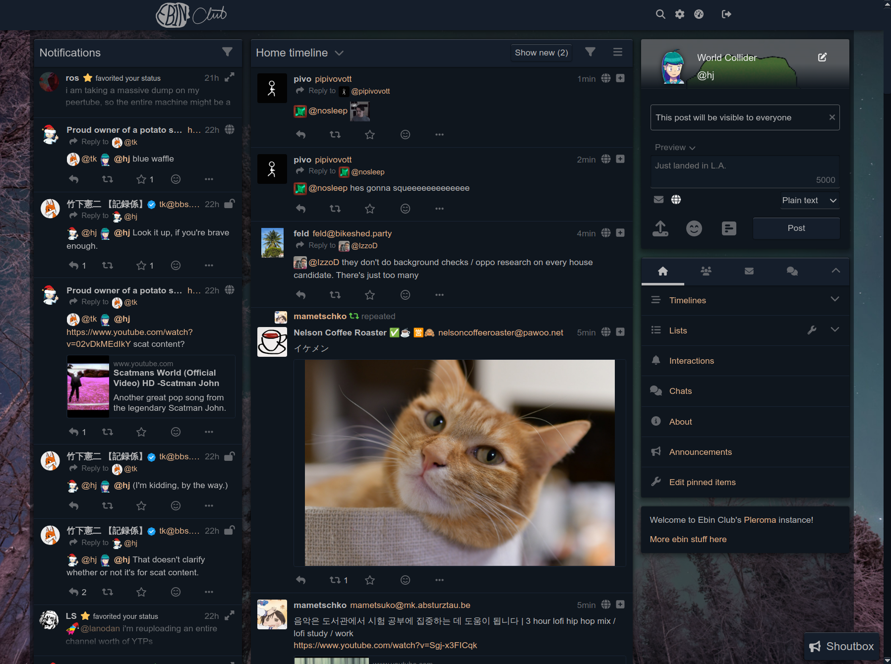

# Pleroma-FE 

> Highly-customizable frontend designed for Pleroma.



# For Translators

To translate Pleroma-FE, use our weblate server: https://translate.pleroma.social/. If you need to add your language it should be added as a json file in [src/i18n/](https://git.pleroma.social/pleroma/pleroma-fe/blob/develop/src/i18n/) folder and added in a list within [src/i18n/languages.js](https://git.pleroma.social/pleroma/pleroma-fe/blob/develop/src/i18n/languages.js). 

Pleroma-FE will set your language by your browser locale, but you can change language in settings.

# For instance admins
You don't need to build Pleroma-FE yourself. Those using the Pleroma backend will be able to use it out of the box. Information of customizing PleromaFE settings/defaults is in our [guide](https://docs-develop.pleroma.social/frontend/CONFIGURATION/) and in case you want to build your own custom version there's [another](https://docs-develop.pleroma.social/frontend/HACKING/)

# Build Setup

``` bash
# install dependencies
npm install -g yarn
yarn

# serve with hot reload at localhost:8080
yarn dev

# build for production with minification
yarn build

# run unit tests
yarn unit
```

# For Contributors:

You can create file `/config/local.json` (see [example](https://git.pleroma.social/pleroma/pleroma-fe/blob/develop/config/local.example.json)) to enable some convenience dev options:

* `target`: makes local dev server redirect to some existing instance's BE instead of local BE, useful for testing things in near-production environment and searching for real-life use-cases.
* `staticConfigPreference`: makes FE's `/static/config.json` take preference of BE-served `/api/statusnet/config.json`. Only works in dev mode.

FE Build process also leaves current commit hash in global variable `___pleromafe_commit_hash` so that you can easily see which pleroma-fe commit instance is running, also helps pinpointing which commit was used when FE was bundled into BE.

# Configuration

Set configuration settings in AdminFE, additionally you can edit config.json. For more details see [documentation](https://docs-develop.pleroma.social/frontend/CONFIGURATION/).
